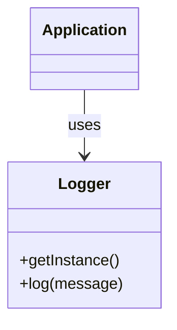
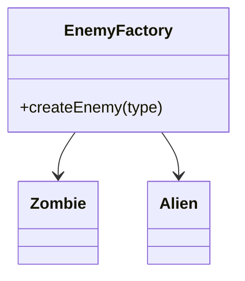
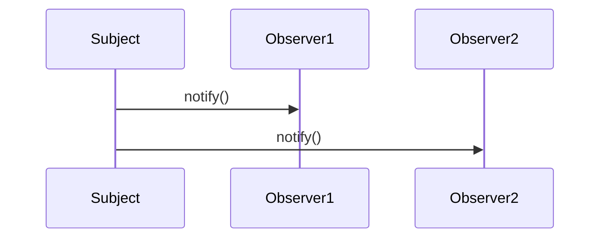
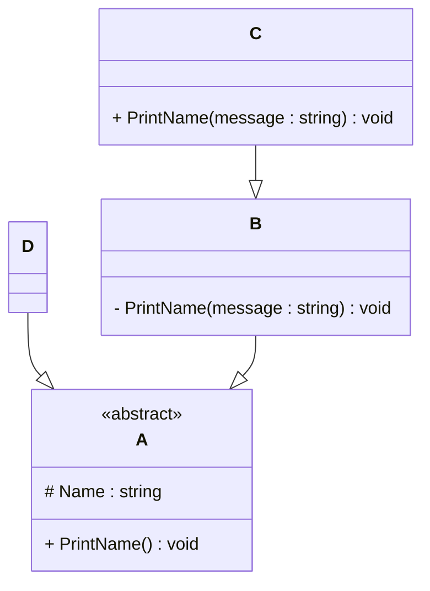

# Programming Test

This test was composed to create a general overview of your knowledge regarding general programming and how it fits with the needs in our lab. Please try to answer all questions using your own knowledge and in your own words. If you get stuck on one of the exercises, still try to give a short answer.

---

## Exercise 1

### Task
Write a program in the language of your choice where:

1. The iteration number (starting from 1), followed by a random number between 1 and 100, is printed 100 times.
2. After every 5 iterations, write an additional separator (e.g., `---`).
3. Write “Lucky number!” after every random number that is divisible by 7.

> Try to keep the procedure as short as possible.
### Solution-1
	#include <bits/stdc++.h>
	using namespace std;
	
	int main() {
	    // Loop from 1 to 100
	    for (int i = 1; i <= 100; ++i) {
	        // Generate a random number between 1 and 100
	        int num = rand() % 100 + 1;
	
	        // Print the count and the number
	        cout << i << ": " << num;
	
	        // If number is divisible by 7, print Lucky number!
	        if (num % 7 == 0)
	            cout << " Lucky number!";
	
	        // Move to next line
	        cout << '\n';
	
	        // After every 5 numbers, print a separator
	        if (i % 5 == 0)
	            cout << "---\n";
	    }
	
	    return 0;
	}

---

## Exercise 2

### 1. **What is your understanding of the term “Design Patterns”?**  
   Provide a description in your own words.
### Answer-1 
Well, in simple words, design patterns are kind of like standard solutions to common problems that we face in software development. Instead of figuring out everything from scratch every time, we can use these patterns as a guide to solve issues more effectively. They aren’t actual code but more like templates or best practices that help in structuring the code better. I’d say they help a lot in making the code more readable, reusable, and also easier to maintain over time.
   

### 2. **Explain the MVC Pattern**  
   - What does MVC stand for?  
   - Explain the pattern in detail.  
   - What are some use cases for this framework?
### Answer-2
    1.MVC stands for Model-View-Controller.
    2.The MVC pattern is a way of organizing code in such a way that you separate the data (Model), the user interface (View), and the logic that connects 
      them (Controller). The Model is all about managing the data, like fetching it from the database and updating it. The View is basically what the user sees, 
      like the HTML or UI part. And the Controller is in the middle, handling the input from the user and deciding what to do with it, like updating the model or 
      refreshing the view.
    3.MVC is super useful in web development. Frameworks like Django follow this pattern. I personally have used it in a couple of projects to 
      keep the backend and frontend separate, which made it way easier to manage and scale later.  
    

### 3. **List three other design patterns**  
   - Provide names and details for three additional design patterns.
   - Explain how you have used those patterns in the past and how they have solved your problem  
   - Use diagrams to explain the design patterns.
### Answer-3
1.Singleton Pattern:
This pattern ensures that a class has only one instance and provides a global point of access to it. I used this when I was working on a logging module for a project. We wanted to make sure all logs go through a single logger instance, and Singleton was perfect for that. It made sure no matter where in the app we logged, it all went to the same place.

2.Observer Pattern:
This one is about setting up a one-to-many relationship between objects so that when one object changes, all its dependents get notified automatically. I applied this in a stock market app where the stock prices kept updating, and all the UI components showing those prices had to refresh in real-time. It saved a lot of manual update code.

3.Factory Pattern:
The Factory pattern is used to create objects without specifying the exact class of the object that will be created. I used this pattern in a game project where we had to create different types of enemies dynamically. Using Factory saved us from hardcoding every type and made the game much more flexible.

## Design Pattern Diagrams

### Singleton

### Factory

### Observer

---

## Exercise 3

### 1. **Implementation Task**  
   Based on the class diagram below, provide an implementation in any object-oriented programming language of your choice.
   

### Answer-1
	class A {
	protected:
	    string Name;
	
	public:
	    virtual void PrintName() = 0;
	};
	
	// Class B inherits A
	class B : public A {
	private:
	    void PrintName(string message) {
	        cout << message << ": " << Name << endl;
	    }
	};

	// Class C inherits B
	class C : public B {
	public:
	    void PrintName(string message) {
	        cout << message << endl;
	    }
	
	    void PrintName() override {
	        PrintName("C");
	    }
	};

	// Class D inherits A
	class D : public A {
	public:
	    void PrintName() override {
	        cout << "D" << endl;
	    }
	};

### 2. **Key Questions**  
   - Are you able to directly create a new instance of `ObjectA`? Please explain your answer.  
   - Given an instance of `ObjectC`, are you able to call the method `PrintMessage` defined in `ObjectB`? Please explain your answer.  
   - Try to explain as many key features of object-oriented programming as you can find in this example.
### Answer-2
1. ObjectA is an abstract class, as shown by the <<abstract>> label.
   In C++ abstract classes cannot be instantiated directly. They are meant to be base classes only, providing a common interface for derived classes.

2. In ObjectB, the method PrintMessage (named PrintName(message) in code) is private, so you can't use it from outside. But ObjectC writes its own version of PrintMessage and makes it public, so if you have an object of ObjectC, you can call it from there.

3. Abstraction – ObjectA gives a general idea (a function without full code), and the other classes finish the details.

- Inheritance – ObjectB, ObjectC, and ObjectD all reuse code from ObjectA or from each other.

- Encapsulation – Some things (like Name or PrintMessage) are hidden using private or protected. This keeps the inside details safe and clean.

- Polymorphism – The PrintName() function works differently depending on whether you’re using ObjectC or ObjectD.

---

## Exercise 4

### Maintaining and Expanding Software for Component Validation

This exercise focuses on strategies for working with existing code bases and ensuring the software remains maintainable as new features and requirements are introduced.

### 1. **Working with Existing Code**  
- How would you approach understanding and contributing to an existing code base with minimal disruption?  
- What practices would you follow to ensure your changes integrate well with the current structure?
### Answer-1
-When working with an existing codebase, the first step is to slow down and observe. I’d begin by exploring the structure of the project—checking the folder layout, reading the README (if available), and reviewing any available documentation. Running the software locally helps me understand how everything ties together. I usually start small, like tracing the flow of a specific feature or endpoint. If I get stuck, I won’t hesitate to ask someone on the team for help or context. The goal is to learn how things work before jumping in with changes, to avoid breaking anything unintentionally.

-I’d make sure my code blends in with the rest by following the same style, patterns, and naming conventions used in the project. If there's a certain way features are structured (like MVC or service-based patterns), I’d stick to that. I’d also try to keep my changes small and focused—solving one problem at a time. Before merging anything, I’d thoroughly test my changes and ideally get them reviewed by a teammate, so any mistakes or inconsistencies can be caught early.

### 2. **Ensuring Maintainability**  
- What techniques would you use to keep the code base clean, modular, and easy to maintain as new features are added?  
- How would you handle code documentation and testing to support long-term maintainability?
### Answer-2
-One key practice is writing modular code—breaking down logic into small, focused components that do one job well. This makes it easier to update or reuse code later. I’d avoid duplication by creating helper functions or utility classes when I notice repeated patterns. Also, I’d aim to name things clearly and consistently so others (or even my future self) can quickly understand what each part does without having to dig deep.

-Good documentation and tests are like a safety net. I’d add comments where the logic might not be immediately obvious and keep a separate high-level overview if needed (like a doc explaining how modules connect). For testing, I’d write unit tests for all the core logic, and if possible, integration tests to make sure different parts work well together. This not only catches bugs early but also gives others confidence that it’s safe to build on top of the existing code.

### 3. **Balancing Flexibility and Stability**  
- How would you design or refactor the software to make it flexible for future changes while ensuring the existing functionality remains stable?  
- Which design patterns or principles would you apply to achieve this balance
### Answer-3
-To make a system flexible yet stable, I’d focus on keeping the code loosely coupled—meaning different parts don’t depend too heavily on each other. This way, future changes won’t ripple across the whole system. I’d also try to isolate the logic that’s most likely to change, and put it behind clear interfaces or configuration files. When refactoring, I’d take it slow—changing one thing at a time and testing thoroughly to ensure existing features aren’t affected.

-I’d lean on SOLID principles, especially the Single Responsibility Principle (keeping each class or function focused on one thing) and the Open/Closed Principle (making code easy to extend without modifying existing parts). For flexibility, patterns like Strategy (to easily switch behavior) or Factory (to control object creation) are really helpful. These patterns help organize the code in a way that new features can be added without rewriting what's already there.

---
